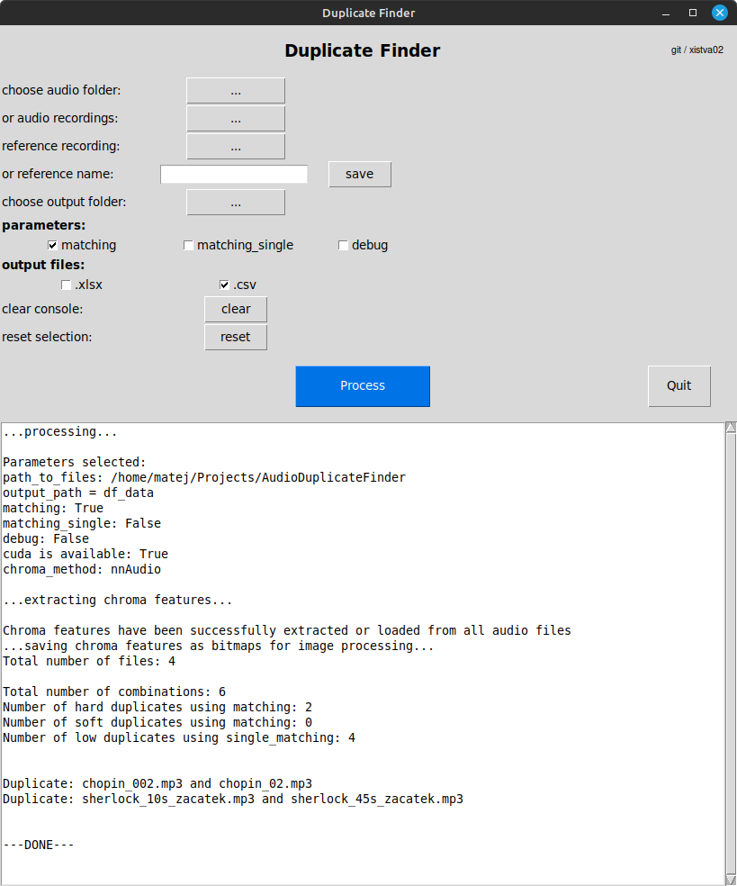

# Audio Duplicate Finder

## Introduction:

This repository contains the **duplicateFinder**, scripts for finding audio duplicates inside a given set of recordings.
Unlike many other approaches, it uses raw audio information without any metadata (except the name of files). It is able to recognise
duplicates even when they slightly differ and/or contain only a segment of the recording.

You will find two main scripts: **df.py** and **df_GUI.py** in this repo. Both contain the same functionality, either called by
flags or a simple Tkinter GUI.

Example of GUI version:

<p align="center">

</p>
<!--  -->

## Description:

The **duplicateFinder** class can be divided into a few steps:
- First, the chroma representation of all files is computed via either 'synctoolbox' or 'nnAudio' modules and saved in 'df_data/chroma' folder (if matching_single is set to True, its chroma vectors and images are saved in 'df_data/reference' folder). If nnAudio is selected (default) and the cuda driver on your device is available, the computation of chroma vectors is much faster. Then, all chroma files are converted to .png images and saved in 'df_data/img folder'.
- All selected images (or a single image, depending on the preset) are compared with all images. This is done by opencv matchTemplate and minMaxLoc methods.
It also works for a small segment of a given audio file; e.g., the first 10 seconds of a recording compared to the whole recording is a match (duplicate) and should be evaluated this way.
- Finally, results are printed to the console (or GUI fake console) and saved in 'df_data/output' folder. The name of output .csv and .xlsx files depends on the method used (such as 'df_matching_hard_duplicates.csv').

The program computes 'hard' duplicates, 'soft' duplicates, and 'low' duplicates. It is possible that two recordings are similar in structure but not exactly the same – parameter soft_val (default is set to 0.5) controls the threshold value.
Low duplicates (similarity value < 0.05) show files that may be a bit similar. All duplicate types are handled and exported separately.
The implementation was tested on Windows 10 (21H2) and Linux Mint 21.1.

### Note: 

Parameters 'matching' and 'matching_single' cannot be set to True in the same time. Similarly, 'reference' and 'reference_name' cannot be set in the same time. However, one can choose 'path_to_files' and 'input_files' simultaneously, automatically discarding the possible duplicate paths.

## Install

To install the dependencies, use:

```
python install -r requirements.txt
```

To load non .wav audio files, install ffmpeg to your OS and add it to the SYS path (see **ffmpeg_installation.txt**). To output results to the .xlsx files using pandas, install openpyxl:

```
python install openpyxl
```

## Example of usage:
Let's have all audio files in '/home/finder_data' folder (and subfolders). To find all duplicates and use all vs. all strategy, use:

```
python dF.py -p /home/finder_data -m True
```

To select a specific file (e.g., 'test_recording.wav') and compare it to all other files in '/home/finder_data' folder, use:

```
python dF.py -p /home/finder_data -r /home/finder_data/test_recording.wav -ms True
```

or

```
python dF.py -p /home/finder_data -rn test_recording -ms True
```

**df_GUI.py** version works the same way; parameters are chosen via graphical interface:

```
python dF_GUI.py
```


Useful flags:

- -o path to the output directory
- -d if True, outputs additional information
- -ex or -csv if True, results are saved as .xlsx and/or .csv files


### Note:

The code is not optimized or clean. It is a result of experimentation. The feedback and comments are appreciated! If you have any questions, feel free to open an issue or send a message to <matej.istvanek@vut.cz>.

### Acknowledgment:

This work was supported by the project TA ČR, TL05000527 Memories of Sound: The Evolution of the Interpretative Tradition
Based on the Works of Antonin Dvorak and Bedrich Smetana and was co-financed with state support of the Technology Agency
of the Czech Republic within the ÉTA Program.
